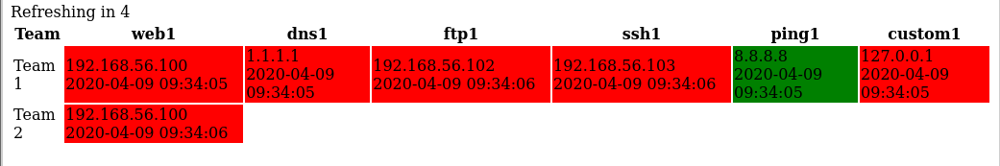

# gizmo
Service checker and scoreboard for CCDC-like exercises.


Currently supports the following services in some fashion:
* ftp
* ssh
* ping
* http
* dns
* external - run an external binary or script

# Scoreboard Example



# Installation

```
go get -u -v github.com/akamensky/argparse
go get -u -v github.com/jlaffaye/ftp
go get -u -v github.com/mattn/go-sqlite3
go get -u -v golang.org/x/crypto/ssh
go get -u -v github.com/whoismissing/gizmo

cd ~/go/src/github.com/whoismissing/gizmo
go build
```

# Tools

[tools/confgen/](./tools/confgen) is a command-line tool to help users generate a config file for gizmo

# Usage

```
usage: gizmo [-h|--help] -i|--input "<value>" [-o|--output "<value>"]
             [-d|--debug]

             Service uptime scoreboard

Arguments:

  -h  --help    Print help information
  -i  --input   Input config filename
  -o  --output  Output database filename. Default: gizmo.db
  -d  --debug   Permit debug logging. Default: false

```

Generally the work flow is to:
1. Use [confgen](./tools/confgen) to generate a JSON config file
2. Pass the config as the input for gizmo `./gizmo -i example.config`
3. View the static web page on port 8080
4. An sqlite3 database will be created storing all of the service checks which can be analyzed later

# Releases

Features of each release are recorded [here](https://github.com/whoismissing/gizmo/releases)

An example JSON configuration file is located at [gizmo/config/examples/gizmo_config.json](https://github.com/whoismissing/gizmo/blob/master/config/examples/gizmo_config.json)

# Contribution

See [CONTRIBUTING.md](CONTRIBUTING.md)
